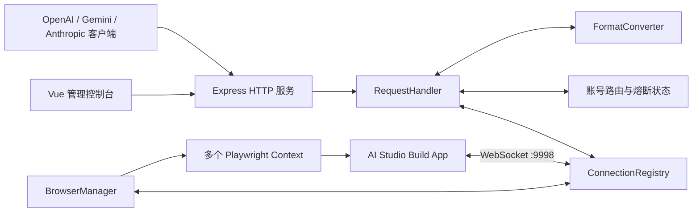

# Aitoapi Custom 项目维护基线

> 用途：作为后续功能追加、故障修复、重构、发布和文档同步的统一参照。
>
> 基线版本：`1.2.6` ｜ 分支：`main` ｜ 基线提交：`d24d14e` ｜ 更新日期：`2026-09-19`

## 1. 文档定位与事实来源

本项目已有用户说明、部署说明、发布记录和架构复盘。本文不替代面向用户的 README，而是回答维护者最常遇到的四个问题：

1. 当前代码实际如何运行；
2. 某项修改应该落在哪些模块；
3. 修改后必须检查哪些联动点；
4. 哪些说明、测试和发布材料需要同步更新。

事实优先级如下：

1. 当前源码与自动化测试；
2. `.env.example`、`package.json`、`Dockerfile`；
3. 本文；
4. `README.md`、`README_CUSTOM.md`、`ARCHITECTURE_REVIEW.md`、历史发布说明。

当文档与源码冲突时，以源码和回归测试为准，并在同一次变更中修正文档。

## 2. 项目概览

Aitoapi Custom 将专用 Google AI Studio Build App 中的浏览器能力包装成兼容接口，向调用方提供 OpenAI、Gemini 和 Anthropic 风格的 API。

它不是普通 HTTP 反向代理，也不是 Google 官方 Gemini API 的简单转发器。核心依赖是：

- Node.js/Express 接收外部 API 请求；
- Playwright 驱动 Firefox/Camoufox，并为每个凭证维护隔离浏览器上下文；
- 浏览器页面通过本机 WebSocket 与 Node 服务通信；
- Node 端完成协议转换、账号调度、重试、流式输出、熔断和统计；
- Vue 3 + Element Plus 提供管理控制台。

### 2.1 当前技术栈

| 层次         | 技术与入口                                              |
| ------------ | ------------------------------------------------------- |
| 运行时       | Node.js，CommonJS 后端                                  |
| HTTP 服务    | Express 4，入口为 `main.js`                             |
| 浏览器自动化 | Playwright 1.59.1 + Firefox/Camoufox                    |
| 内部通信     | `ws`，固定端口 `9998`                                   |
| 前端         | Vue 3、Vue Router、Element Plus、Vite 5、Less           |
| 持久化       | 本地 JSON/JSONL 文件，无数据库                          |
| 容器         | `node:24-slim`，内置 Camoufox、Xvfb、x11vnc、websockify |
| 代码质量     | ESLint、Stylelint、Prettier、Husky、lint-staged         |

### 2.2 系统边界

本项目负责：协议兼容、浏览器上下文生命周期、账号调度、请求/响应关联、管理控制台和本地状态持久化。

本项目不负责：Google 账号本身、上游 AI Studio Build App 的稳定性、官方 API SLA、跨节点分布式调度，以及数据库级高可用。

固定的 Build App 地址位于 `BrowserManager.targetUrl`。该页面结构或行为一旦变化，浏览器初始化、弹窗处理、WebSocket 建连和保活逻辑都可能需要同步调整。

## 3. 总体架构



### 3.1 核心组件

| 组件                        | 主要职责                                              | 修改时重点关注                                     |
| --------------------------- | ----------------------------------------------------- | -------------------------------------------------- |
| `main.js`                   | 加载环境文件、启动系统、优雅退出                      | `NODE_ENV`、信号处理、启动失败行为                 |
| `ProxyServerSystem`         | 组装组件、启动 HTTP/WS、注册公开 API                  | 中间件顺序、鉴权边界、端口、关停顺序               |
| `BrowserManager`            | 浏览器与上下文池、页面唤醒、健康检查、VNC、隔离探测   | 上下文并发、关闭顺序、页面弹窗、WebSocket 就绪     |
| `ConnectionRegistry`        | 按账号登记 WebSocket、按请求分发消息、管理队列        | `authIndex` 和 `requestAttemptId` 校验、断线宽限期 |
| `RequestHandler`            | 请求入口、账号选择、重试、流式/非流式响应、熔断、统计 | 请求级账号绑定、429、客户端断开、队列释放          |
| `FormatConverter`           | OpenAI/Gemini/Anthropic 请求与响应转换                | 工具调用、图片、思考内容、用量、结束原因、流式状态 |
| `AuthSource`                | 扫描、校验、去重、禁用/启用认证文件                   | 文件状态字段、最高索引保留、轮询列表重建           |
| `AuthSwitcher`              | 单连接兼容模式下的账号切换                            | 与多连接请求级路由的边界                           |
| `UsageStatsService`         | 请求与尝试级统计、JSONL 导入导出                      | 统计口径、隐私、文件增长                           |
| `StatusRoutes`              | 状态、账号、运行参数、统计和文件管理接口              | 会话鉴权、持久化、系统忙状态                       |
| `AuthRoutes` / `CreateAuth` | 控制台登录、VNC 认证创建                              | 登录限流、会话安全、VNC 资源清理                   |

### 3.2 目录职责

```text
.
├─ main.js                         # 进程入口
├─ src/
│  ├─ core/                        # 服务编排、浏览器、请求、转换、连接、统计
│  ├─ auth/                        # 凭证读取、切换、创建
│  ├─ routes/                      # 控制台与管理 API
│  └─ utils/                       # 配置、日志、队列、代理、版本检查、错误类型
├─ ui/
│  ├─ app/                         # Vue 源码
│  ├─ locales/                     # 中英文资源
│  ├─ public/                      # 静态资源
│  └─ dist/                        # 构建产物，由 Express 直接提供
├─ scripts/
│  ├─ auth/                        # 认证生成脚本
│  ├─ client/build.js              # Build App 侧代理客户端脚本
│  └─ tests/                       # 无测试框架的 Node 回归脚本
├─ configs/models.json             # 模型发现元数据
├─ docs/                           # 部署、API 示例和维护文档
└─ .github/workflows/              # 镜像发布与发布通知
```

## 4. 启动与关闭流程

### 4.1 配置加载

`main.js` 根据 `NODE_ENV` 选择环境文件：

- `production`：加载 `.env`；
- 其他环境：加载 `.env.development`。

`ConfigLoader` 先创建默认配置，再应用环境变量，随后应用 `configs/runtime-settings.json` 中由 Web UI 保存的运行参数。当前实现中，运行时文件对其包含的字段具有更高优先级。

随后读取 `configs/models.json`。读取失败时只暴露 `models/gemini-2.5-flash-lite` 作为回退模型。

### 4.2 服务启动

启动顺序是：

1. 创建并监听 HTTP 服务；
2. 在固定 `9998` 端口启动内部 WebSocket 服务；
3. 启动禁用账号 AutoHeal 定时探测；
4. 启动陈旧消息队列清理；
5. 扫描可用认证文件；
6. 按 `INITIAL_AUTH_INDEX` 和轮询列表确定启动顺序；
7. 按 `MAX_CONTEXTS` 预热上下文池；
8. 激活首个就绪账号，其余账号后台加载。

没有认证文件时，HTTP/WS 服务仍会启动，控制台进入账号绑定模式。

### 4.3 优雅关闭

收到 `SIGINT` 或 `SIGTERM` 后，`ProxyServerSystem.shutdown()` 负责停止定时任务、关闭消息队列、浏览器、WebSocket 和 HTTP 服务。新增长期定时器、后台 Promise 或外部资源时，必须把清理逻辑接入该流程。

## 5. 请求主链路

1. Express 完成 CORS、原始请求体收集和 JSON/表单解析。
2. 控制台路由先注册，并使用 Session 鉴权。
3. 模型 API 再经过 API Key 鉴权。
4. `RequestHandler` 识别协议类型并生成唯一 `request_id`。
5. `FormatConverter` 将 OpenAI/Anthropic 请求规范化为 Gemini 请求；原生 Gemini 请求则进行必要修正。
6. 路由器从已连接、可用、未隔离的账号中选出负载最低者，轮询游标只用于并列时打破平局。
7. 请求绑定到一个 `authIndex`；每次重试另有唯一 `request_attempt_id`。
8. `ConnectionRegistry` 为请求建立 `MessageQueue`，并通过对应账号的 WebSocket 发送 `proxy_request`。
9. 页面侧返回 `response_headers`、`chunk`、`error`、`stream_close` 等事件。
10. 注册表同时校验账号和尝试编号，丢弃旧账号或旧重试产生的迟到消息。
11. `RequestHandler` 按调用协议输出真实流、伪流或非流式响应，并在结束时释放队列、请求绑定和在途计数。

一个请求只发送给一个账号，不会向所有在线账号广播生成请求。广播仅用于日志级别等控制消息。

## 6. 多账号调度与故障语义

### 6.1 账号集合

`AuthSource` 区分：

- `initialIndices`：目录中扫描到的编号；
- `availableIndices`：JSON 可读取、可解析的凭证；
- `rotationIndices`：排除过期、禁用和重复账号后的调度集合；
- `duplicateIndices`：同一邮箱的旧凭证，轮询保留最高编号；
- `expiredIndices`：文件中 `expired: true`；
- `disabledIndices`：文件中 `disabled: true`。

只有像邮箱地址的 `accountName` 才参与自动去重，避免把任意显示名错误合并。

### 6.2 路由选择

请求候选账号必须同时满足：

- WebSocket 已连接；
- 仍在有效凭证集合中；
- 未过期、未禁用；
- 不在 WebSocket crash-loop 隔离期；
- 不在账号级冷却；
- 未达到当前使用周期阈值；
- 对当前“原始模型”没有未到期的模型冷却。

候选账号按 `inFlight` 最小值优先；同负载时才轮询。这使长流式请求不会持续挤占同一账号。

### 6.3 使用次数轮换

- 单连接模式继续使用 `AuthSwitcher` 的全局计数；
- 多连接或无限上下文模式使用每账号计数；
- 达到 `SWITCH_ON_USES` 后不立即破坏在途请求，而是等该账号请求排空再原子替换上下文；
- 新上下文和 WebSocket 就绪后才关闭旧槽位；
- 全部可用账号都耗尽一个周期时重置周期。

### 6.4 HTTP 429：两层处理

当前源码同时存在两层机制，维护时不得只考虑其中一层：

1. **模型路由冷却**：记录“账号 + 去后缀后的原始模型”冷却，退避由 `ACCOUNT_COOLDOWN_MS` 起步，最多到 `ACCOUNT_COOLDOWN_MAX_MS`，状态写入 `data/account-route-state.json`。
2. **账号级 quota 熔断**：单次上游 429 会把该凭证持久化标记为 `disabledReason: quota_exhausted`，关闭其上下文，默认至少等待 20 分钟后再由 AutoHeal 隔离探测。

因此，虽然模型冷却数据仍用于调度与可观测性，但当前 `v1.2.6` 的实际效果是：一次额度型 429 会暂时将整个凭证移出轮询，而不是只跳过该账号的单个模型。

### 6.5 401、403 与其他自动禁用状态

`AUTO_DISABLE_STATUS_CODES` 默认是 `401,403`：

- 401 记录为 `unauthorized`；
- 页面/账号探测阶段的 403 记录为 `forbidden`；
- 带有模型上下文的请求 403 只表示该账号没有该模型权限：请求会切换到其他账号，但不会禁用或移除原账号，因此该账号仍可服务 `gemini-3.8-flash` 等其他模型；
- 其他已配置状态记录为 `http_<status>`。

禁用操作是单飞的：同一账号同时被多个失败路径观察到时，只执行一次关闭与重平衡。只有页面/账号级 `forbidden` 会在 AutoHeal 周期中自动移除认证文件，并先备份到 `data/removed-auth-backup/`。

#### 6.5.1 403 诊断记录（2026-09-20）

对线上运行实例做了脱敏后端核验：历史 403 记录集中在 `gemini-3.5-flash` 与
`gemini-3-flash-preview`，而同一批账号的 `gemini-3.8-flash` 有多次成功记录；一次直接
请求 `gemini-3.8-flash` 也返回 HTTP 200。结论是这些 403 是上游真实的“模型权限不足”响应，
不是凭证整体失效或账号级封禁。此前它们被统一写成 `disabledReason=forbidden`，并可能被
AutoHeal 移出账号池，属于误分类。后续代码会在模型请求路径携带模型名，模型级 403 只触发
本次请求换号，不再禁用或移除账号；页面级 403 仍按账号级封禁处理。

### 6.6 WebSocket crash-loop 与 AutoHeal

- 60 秒内累计 3 次异常断开：隔离 2 分钟；
- 累计 2 个 crash-loop episode：持久化禁用，原因是 `crash_loop`；
- AutoHeal 默认每 5 小时运行一次，每账号隔离探测默认最多 10 分钟；
- 探测使用上下文池之外的一次性浏览器，不占 `MAX_CONTEXTS` 槽位；
- 健康则清空相关计数并重新启用；失败则保持禁用，下个周期继续，不设最大重试次数。

## 7. 对外接口

### 7.1 模型与生成 API

| 接口                              | 兼容目标                  | 处理入口                           |
| --------------------------------- | ------------------------- | ---------------------------------- |
| `GET /v1/models`                  | OpenAI 模型列表           | `ProxyServerSystem`                |
| `GET /v1beta/models`              | Gemini 模型列表           | `ProxyServerSystem`                |
| `POST /v1/chat/completions`       | OpenAI Chat Completions   | `processOpenAIRequest`             |
| `POST /v1/embeddings`             | OpenAI Embeddings         | `processOpenAIEmbeddingsRequest`   |
| `POST /v1/openai/embeddings`      | OpenAI Embeddings 别名    | 同上                               |
| `POST /v1/responses`              | OpenAI Responses          | `processOpenAIResponseRequest`     |
| `POST /v1/responses/input_tokens` | Responses 输入 token 统计 | `processOpenAIResponseInputTokens` |
| `POST /responses/input_tokens`    | 上一接口的兼容别名        | 同上                               |
| `POST /v1/messages`               | Anthropic Messages        | `processClaudeRequest`             |
| `POST /v1/messages/count_tokens`  | Anthropic token 统计      | `processClaudeCountTokens`         |
| `/upload/*`                       | Gemini 上传流程           | `processUploadRequest`             |
| 其他路径                          | Gemini 原生 API 透传/转换 | `processRequest`                   |

API Key 支持 `x-goog-api-key`、`Authorization: Bearer`、`x-api-key` 和查询参数 `key`。未配置 `API_KEYS` 时会回退为 `123456`，生产环境必须覆盖该默认值。

### 7.2 管理接口

管理接口使用 Express Session，而不是普通模型 API Key 中间件，主要分为：

- 登录与 VNC：`/login`、`/logout`、`/api/vnc/*`；
- 状态与版本：`/health`、`/api/status`、`/api/version/check`；
- 模型探测：`GET /api/model-probes`、`POST /api/model-probes/runs`、`POST /api/model-probes/runs/:runId/cancel`；
- 用量统计：`/api/usage-stats*`；
- 账号操作：切换、测试、去重、启禁用、单个/批量删除与下载；
- 运行参数：流式模式、强制工具、日志、重试、上下文、冷却、AutoHeal；
- 认证文件：`/api/files*`。

新增管理接口时必须明确它属于公开健康检查、Session 管理面还是 API Key 数据面，并放在正确的中间件之前或之后。

## 8. 模型配置与名称后缀

### 8.1 模型元数据

`configs/models.json` 当前包含 33 个基础模型，其中 24 个声明 `thinking: true`。模型发现接口会在进程启动时基于此文件生成后缀变体。

常用字段：

- `name`：必须以 `models/` 开头；
- `displayName`、`description`、`version`：发现接口元数据；
- `inputTokenLimit`、`outputTokenLimit`：OpenAI 列表中的上下文与输出限制；
- `supportedGenerationMethods`：决定是否生成对话后缀变体；
- `thinking: true`：决定是否生成思考等级变体；
- 温度、Top-P、Top-K、阶段等兼容元数据。

只有名称以 `models/gemini-` 开头、支持 `generateContent`，且名称不包含 image、tts、embedding、computer-use、robotics 的模型会扩展对话后缀。

### 8.2 可用模型探测

`ModelProbeService` 从 `config.modelList` 动态选择基础模型，不读取模型发现接口生成的后缀别名。当前目录对应 17 个文本模型和 7 个图像模型；TTS、Embedding、Robotics 与 Computer Use 不进入探测。

探测是控制台手动任务，并且会产生真实上游调用。它按启用账号顺序工作，每个账号只建立一个池外隔离浏览器，在其中串行测试仍未成功的模型；模型一旦成功便不再使用后续账号测试。文本响应要求有效文本，Gemini 图片响应要求 `inlineData`，Imagen 响应要求 `predictions[].bytesBase64Encoded`。图片数据只在内存中验证，不落盘。

结果分为 `available`、`unavailable`、`indeterminate`、`not_tested`。只有所有已启用账号都明确返回 403/404 时才标记不可用；401、429、超时、5xx 和无效响应均属于不确定。探测不切换生产当前账号、不占生产上下文、不修改账号启用状态或普通请求统计，且 `/v1/models` 始终返回静态完整目录。

### 8.3 后缀语法

规范顺序为：

```text
<base-model>[-minimal|-low|-medium|-high][-real|-fake][-search][-code]
```

示例：

```text
gemini-3-flash-preview-high-fake-search-code
```

解析顺序固定为：

1. 从末尾剥离 `search` / `code`；
2. 剥离 `real` / `fake`；
3. 剥离思考等级；
4. 使用清理后的模型名做实际请求和冷却键。

思考等级也兼容括号形式，例如 `gemini-3-flash-preview(high)-real`。后缀思考等级会同时设置 `thinkingLevel` 和 `includeThoughts: true`。

`search` 注入 `googleSearch`，`code` 注入 `codeExecution`；客户端已提供相同内置工具时不会重复注入。全局 `FORCE_*` 配置与模型后缀共同生效。

## 9. 配置与持久化

### 9.1 配置层级

| 来源                            | 内容                             | 是否持久化       |
| ------------------------------- | -------------------------------- | ---------------- |
| 代码默认值                      | 所有基础默认值                   | 随代码           |
| `.env` / `.env.development`     | 启动、密钥、浏览器、调度默认值   | 运维维护         |
| `configs/runtime-settings.json` | Web UI 可持久化的数值配置        | 自动生成         |
| Web UI 内存切换                 | 流模式、强制工具、日志等部分开关 | 部分仅到进程重启 |

Web UI 当前持久化：`maxContexts`、`maxRetries`、`retryDelay`、`autoDisableStatusCodes`、两个 429 冷却参数、AutoHeal 周期和超时。

流式模式、强制思考/搜索/代码/URL、更新检查、认证更新、安全阈值和日志显示设置目前主要修改内存值，重启后回到环境变量或默认值。追加设置项时必须明确是否需要跨重启保存。

### 9.2 运行数据

| 路径                            | 内容                                    | Git 状态 / 注意事项 |
| ------------------------------- | --------------------------------------- | ------------------- |
| `configs/auth/auth-N.json`      | Playwright storage state + 账号状态字段 | 已忽略；敏感凭证    |
| `configs/runtime-settings.json` | UI 持久化参数                           | 已忽略              |
| `data/usage-stats.jsonl`        | 请求统计                                | 已忽略；持续增长    |
| `data/account-route-state.json` | 冷却、quota 与错误状态                  | 已忽略              |
| `data/model-probes.json`        | 最近完整模型探测结果与当前任务状态      | 已忽略；原子写入    |
| `data/removed-auth-backup/`     | 自动移除账号备份                        | 已忽略；敏感凭证    |
| `proxylist.txt`                 | 每账号固定代理候选                      | 已忽略；可能含密码  |
| `proxy_mapping.json`            | 账号到代理的稳定映射                    | 已忽略；原子写入    |

部署备份和迁移至少要覆盖 `configs/auth/`、`configs/runtime-settings.json`、`data/`、`proxylist.txt` 和 `proxy_mapping.json`。不得把这些文件提交到仓库、日志或问题附件。

### 9.3 固定代理

根目录存在有效 `proxylist.txt` 时启用每账号固定代理。`StickyProxyManager` 为账号分配首个空闲代理并将映射保存到 `proxy_mapping.json`；账号或代理消失时会清理旧映射。代理不足的账号无法建立上下文。

若未启用固定代理，则浏览器上下文使用 `HTTP_PROXY` / `HTTPS_PROXY` / `NO_PROXY` 解析结果。

## 10. 前端与管理面

Vue 路由只有 `/`、`/login`、`/auth` 和 404 页面。生产构建输出到 `ui/dist`，由 Express 静态托管。

状态页承担账号列表、统计、日志、运行参数和更新检查等多数功能；模型探测独立放在 `ui/app/components/ModelProbePanel.vue`，避免继续扩大主页面。新增后端字段时通常需要同步：

1. `StatusRoutes._getStatusData()`；
2. `ui/app/pages/StatusPage.vue` 的状态模型、界面和请求；
3. `ui/locales/zh.json` 与 `ui/locales/en.json`；
4. 必要时更新 `EnvVarTooltip.vue`；
5. 重新运行 `npm run build:ui` 并确认 `ui/dist` 变化合理。

模型探测仅在任务运行时轮询。刷新页面后由 `GET /api/model-probes` 恢复当前进度；进程重启会把遗留运行任务标记为 `interrupted`，不会覆盖最近一次完整结果。模型目录或账号 credential/state 版本变化时，旧结果继续显示并标记为需要重新探测。

前端使用 `v-html` 展示部分内容，改动对应数据源时要进行 HTML 转义或继续使用现有 `escapeHtml` 工具，避免扩大 XSS 面。

## 11. 常见变更的落点

### 11.1 新增或更新模型

1. 修改 `configs/models.json`；
2. 确认是否支持生成、思考、图片、TTS、Embedding 等能力；
3. 检查 `expandModelListWithSuffixes()` 是否应该生成变体；
4. 检查三种兼容格式对该能力的转换；
5. 增补 `modelSuffix.test.js` 或新的转换测试；
6. 更新 README 模型说明与发布记录。

### 11.2 新增 API 兼容端点

1. 在 `ProxyServerSystem._createExpressApp()` 中显式注册；
2. 在 `RequestHandler` 新增入口和统计分类；
3. 在 `FormatConverter` 实现双向转换；
4. 明确流式、非流式、客户端断开、错误格式和 token 用量；
5. 确认是否应走 catch-all 原生 Gemini 路径；
6. 添加正常、上游错误、超时、重试和迟到消息测试。

### 11.3 修改账号路由或重试

至少联动检查：

- 请求级 `authIndex` 绑定是否保持；
- `request_attempt_id` 是否在重试时推进；
- 旧消息是否会被丢弃；
- `inFlight` 是否在所有退出路径归零；
- 上下文是否只在队列排空后关闭；
- 429 模型冷却、账号 quota 熔断、401/403 禁用是否重复执行；
- 单连接和多连接模式是否都保留；
- 客户端中断是否向浏览器发送取消事件。

### 11.4 新增运行参数

1. 在 `ConfigLoader` 增加默认值、环境变量解析和校验；
2. 在 `.env.example` 写明单位、范围、默认值和安全影响；
3. 若需跨重启保存，在 `StatusRoutes._saveRuntimeSettings()` 和 `_applyRuntimeSettings()` 同时加入；
4. 增加管理 API 和状态输出；
5. 更新中英文 UI 与提示；
6. 增加持久化回归测试，兼顾 Windows 重命名和 Docker 单文件 bind mount。

### 11.5 修改浏览器页面适配

优先检查 `BrowserManager` 中：页面错误识别、Trust/Skip/Launch 弹窗、目标页面唤醒、WebSocket 就绪检测、HealthMonitor、BackgroundWakeup，以及隔离探测与生产上下文是否保持同等页面处理能力。

该类改动需要真实账号集成验证；纯单元脚本不能覆盖 Google 页面变化。

## 12. 变更影响矩阵

| 改动区域          | 必查模块                                               | 必跑回归                                   |
| ----------------- | ------------------------------------------------------ | ------------------------------------------ |
| 请求格式/工具调用 | `FormatConverter`、`RequestHandler`                    | model suffix、stream integrity、对应新测试 |
| 流式处理          | `RequestHandler`、`MessageQueue`、`ConnectionRegistry` | stream integrity、routing                  |
| 多账号/轮换       | `RequestHandler`、`BrowserManager`、`AuthSwitcher`     | routing、background wakeup                 |
| 429/禁用/恢复     | `RequestHandler`、`AuthSource`、`StatusRoutes`         | quota、crash-loop、autoheal                |
| 浏览器初始化      | `BrowserManager`、Build App 页面脚本                   | background wakeup、autoheal、真实账号冒烟  |
| 控制台设置        | `StatusRoutes`、`StatusPage.vue`、locales              | runtime settings、lint、UI build           |
| 统计              | `UsageStatsService`、`StatusRoutes`、`StatusPage.vue`  | usage stats limit、导入导出                |
| 认证文件          | `AuthSource`、`CreateAuth`、`StatusRoutes`             | 去重、启禁用、VNC 实测                     |

## 13. 开发、测试与发布

### 13.1 常用命令

```bash
npm install
npm run dev
npm run build:ui
npm start
npm run lint
npm run format:check
```

认证相关：

```bash
npm run setup-auth
npm run setup-auth-batch
npm run save-auth
```

### 13.2 已登记回归测试

```bash
npm run test:routing
npm run test:background-wakeup
npm run test:model-suffix
npm run test:stream-integrity
npm run test:crashloop-quarantine
npm run test:crashloop-autoheal
npm run test:quota
npm run test:autoheal-probe
```

仓库还有两个未注册到 `package.json` 的测试：

```bash
node scripts/tests/runtimeSettingsSave.test.js
node scripts/tests/usageStatsLimit.test.js
```

建议后续增加统一的 `test` / `test:all` 脚本，并在 GitHub Actions 中执行 lint、全部回归测试和 UI 构建。目前工作流只负责发布镜像和发布通知，没有持续集成质量门禁。

### 13.3 发布检查清单

- [ ] `package.json` 版本与发布标签一致；
- [ ] 所有回归测试通过；
- [ ] lint、格式检查和 UI 构建通过；
- [ ] 用真实账号完成至少一次 OpenAI、Gemini、Anthropic 冒烟；
- [ ] 验证真实流与伪流；
- [ ] 验证多账号并发、429 切换、客户端断开；
- [ ] 验证无凭证启动和 VNC 添加凭证；
- [ ] 更新 `README_CUSTOM.md`、相关 API 文档和发布说明；
- [ ] 检查镜像 amd64/arm64 构建；
- [ ] 确认提交中没有 `.env`、auth、data、代理和调试文件。

## 14. 当前验证基线与已知维护债务

### 14.1 2026-09-19 验证结果

在 Node `v24.19.0` 环境中执行：

- 8 个 `package.json` 已登记回归脚本全部通过；
- `runtimeSettingsSave.test.js` 通过；
- `usageStatsLimit.test.js` 通过；
- 合计 10 个测试文件通过；
- `lint` 未通过：共 304 个问题（303 个错误、1 个警告），多数是现有格式和对象键排序问题。

这意味着当前功能回归脚本可作为行为基线，但 lint 尚不能作为干净门禁。后续若集中修复格式，应单独提交，避免与业务改动混在一起造成巨大 diff。

### 14.2 高优先级维护债务

1. **大型文件风险**：`RequestHandler.js` 约 5970 行、`FormatConverter.js` 约 3674 行、`BrowserManager.js` 约 3015 行、`StatusPage.vue` 约 7425 行，职责密集，修改容易产生跨路径回归。
2. **说明与实际 429 语义不一致**：部分旧文档仍描述为仅模型级冷却；当前代码还会账号级 quota 熔断。
3. **测试入口不统一**：两个测试未注册，且无 CI 自动运行。
4. **lint 基线不干净**：包括 `package.json` 缩进、测试文件格式、对象键排序、一个未使用常量及少量前端问题。
5. **AutoHeal 配置来源不完全一致**：默认值和 UI 运行时文件已支持，但 `.env.example` 与 `ConfigLoader` 没有对应环境变量入口。
6. **HTTPS 分支不可配置**：`ProxyServerSystem` 检查 `sslKeyPath` / `sslCertPath`，但当前 `ConfigLoader` 未提供对应配置项，实际部署应由反向代理终止 TLS。
7. **远端页面强耦合**：固定 Build App URL、页面按钮与 WebSocket 协议是核心外部依赖，需要真实环境冒烟和快速回滚能力。

### 14.3 建议的重构边界

重构应保持行为不变并分阶段进行：

- 从 `RequestHandler` 拆出 `AccountRouter`、`QuotaCircuitBreaker`、`StreamResponder`、`RequestTracker`；
- 从 `FormatConverter` 按 OpenAI Chat、Responses、Anthropic、Gemini 原生拆分适配器；
- 从 `BrowserManager` 拆出 `ContextPool`、`PageBootstrapper`、`HealthMonitor`、`AutoHealProbe`；
- 将 `StatusPage.vue` 拆成账号、统计、运行设置、日志等组件；
- 先为拆分边界补契约测试，再移动代码。

## 15. 文档更新规则

每次功能变更至少检查以下文档：

| 变化            | 必须同步                                |
| --------------- | --------------------------------------- |
| 用户可见功能    | `README.md`、`README_CUSTOM.md`         |
| 环境变量/默认值 | `.env.example`、本文第 9 节             |
| API 或请求格式  | `docs/*/api-examples.md`、本文第 7/8 节 |
| 部署方式        | `Dockerfile`、对应部署文档              |
| 架构/调度/熔断  | 本文第 3/5/6 节                         |
| 发布行为        | 新版本 `RELEASE_NOTES_*.md`             |
| 测试命令        | `package.json`、本文第 13 节            |

更新本文时同时修改顶部的版本、提交和日期。若只更新文档措辞而没有改变运行行为，可保留代码基线提交，并在提交说明中注明“文档校正”。
